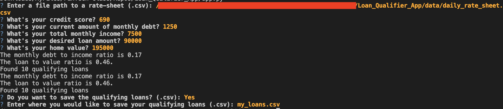
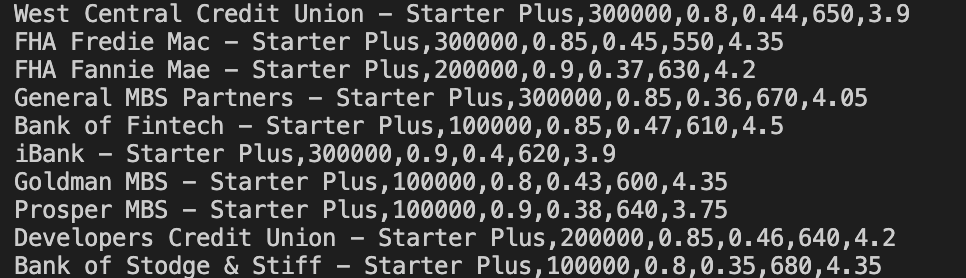

# Loan_Qualifier_App

New features and enhancements to the Loan Qualifier Application.

Please be sure to install all the prerequisites (libraries) before running the program:

- pip install fire
- pip install questionary

The other libraries, **pathlib and sys** should be installed by default. If not, run the same *pip install "libraby name"* command.

The applications is using **questionary** to implement dialog into the program:

```
    csvpath = questionary.confirm("Do you want to save the qualifying loans? (.csv):").ask()
    csvpath = questionary.text("Enter where you would like to save your qualifying loans (.csv):").ask()
    csvpath = Path(csvpath)
```

After completing the prereq, run the [app.py](app.py) program. See following screenshot as an example run of the application:



Below is an example of the qualified loans from the example run:



Please share any suggestions to improve the Loan Qualifier Application.
